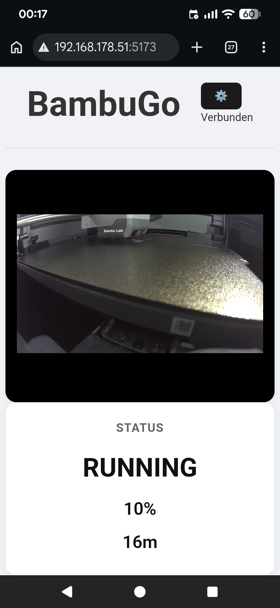
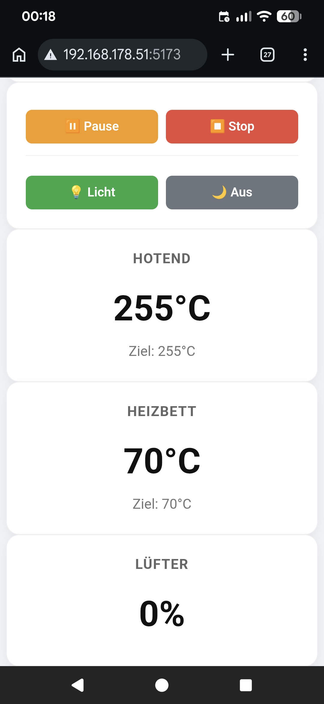
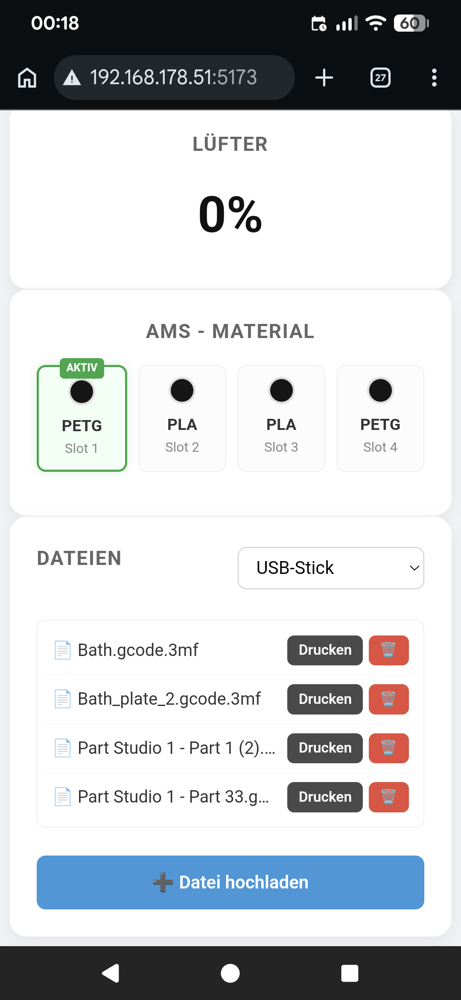
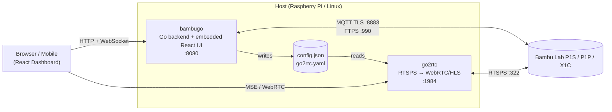

# BambuGo 🐼🌕





**BambuGo** is a lightweight, self-hosted dashboard for Bambu Lab printers (P1S, P1P, X1C). 
It provides a mobile-first React dashboard to monitor and control your printer from anywhere (especially useful when combined with Tailscale).

## Features

- 📱 **Mobile Dashboard:** A responsive React UI for monitoring temperatures, progress, and AMS status.
- 📹 **Live Camera:** Integrated support for the RTSPS camera stream (via `go2rtc`), bypassing the proprietary MJPEG port.
- 💡 **Remote Control:** Toggle chamber lights, pause, resume, or stop prints directly from the web.
- 📁 **File Management:** Upload `.gcode.3mf` files via FTPS and start prints from the browser.
- 🛡️ **Tailscale Ready:** Designed to work perfectly with Tailscale for secure remote access without port forwarding.
- 🐳 **Docker-first:** One command (`docker compose up -d`) brings up the whole stack.

## Architecture



On startup and whenever the credentials are saved via the web UI, the Go backend generates `go2rtc.yaml` from `config.json` — so there is a single source of truth.

## Quickstart (Docker)

### Prerequisites

- Docker + Docker Compose
- A Bambu Lab printer in **LAN Mode** with an **Access Code** (printer menu → Network / WLAN)

### Setup

```bash
git clone https://github.com/SebastianBaltes/bambugo.git
cd bambugo
docker compose up -d
```

Open `http://<your-host>:8080` in a browser. On first start, a **setup dialog** asks for:

- **Printer IP** (e.g. `192.168.1.55`)
- **Serial Number** (e.g. `01S00A...`)
- **Access Code** (8-digit LAN code)

After saving, the backend reconnects automatically and `go2rtc` picks up the camera stream. **No credentials are ever hardcoded or committed.** Your `config.json` lives on the host in `./data/` and is git-ignored.

> ⚠️ If you need to restart the camera stream after the first configuration, run `docker compose restart go2rtc`.

## Development

For hacking on BambuGo without Docker:

```bash
# Backend
cd backend
go build -o bambugo .
./bambugo   # reads ./config.json (or $BAMBUGO_CONFIG)

# Frontend (dev server with HMR, talks to backend on :8080)
cd frontend
npm install
npm run dev -- --host
```

For a production-like build, run `npm run build` inside `frontend/`, copy `frontend/dist/*` into `backend/web/`, and rebuild the Go binary — it will embed the UI and serve it on port 8080.

### Environment variables

| Variable | Default | Purpose |
|---|---|---|
| `BAMBUGO_CONFIG` | `config.json` | Path to the printer config file |
| `BAMBUGO_GO2RTC_YAML` | *(unset)* | If set, backend writes/refreshes go2rtc config here |
| `BAMBUGO_LOG` | `debug.log` | Debug log file path |

## Security notes

- The Bambu Lab access code is stored in `config.json` (mode `0600`) on the host.
- `config.json`, `go2rtc.yaml` and `.env` are in `.gitignore` — **never** commit them.
- If you previously ran a pre-Docker version that had constants in `backend/main.go`, rotate your printer access code just to be safe.

## License

This project is licensed under the **MIT License** — see the [LICENSE](LICENSE) file for details.
